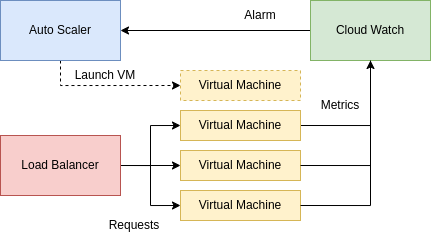

<a href="https://dei.tecnico.ulisboa.pt/"></a>

### [Cloud Computing and Virtualization 2023/2024](https://fenix.tecnico.ulisboa.pt/disciplinas/AVExe23/2023-2024/2-semestre) ([MEIC-A](https://fenix.tecnico.ulisboa.pt/cursos/meic-a)/[MEIC-T](https://fenix.tecnico.ulisboa.pt/meic-t), [METI](https://fenix.tecnico.ulisboa.pt/merc), [MECD](https://fenix.tecnico.ulisboa.pt/cursos/mecd))

&nbsp;
&nbsp;
&nbsp;
&nbsp;

# Lab 2: Introduction to AWS - Amazon Web Services

---

## Overview

- [AWS](https://aws.amazon.com/) is Amazon's cloud services platform;

- We will use it in this course to learn about “Infrastructure-as-as-Service” (IaaS) platforms and develop the course project;

- The goal of this lab is to learn how to set up a basic auto-scaling group (auto scaler) with a load balancer:



---

### AWS Account Setup

To use AWS you will need an AWS Free-tier account in order to be able to access and allocate resources. 

- Register at [https://aws.amazon.com/free](https://aws.amazon.com/free);

- When asked for a credit card, use an MBNET/MBWAY (from your e-banking or mbway.pt) or some other virtual card with a low balance (e.g., 5 EUR) to register (AWS may try to check if the card is real by creating a temporary transaction of 1 USD);

- Follow this [walkthough](https://gitlab.rnl.tecnico.ulisboa.pt/cnv/cnv24/-/blob/master/labs/lab-aws/res/create-verify-aws-free-tier-account.pdf) to create and verify your AWS Free-tier account;

- When using AWS, two **important!** notes to keep in mind:

    - **Use only Free Tier resources!**

    - **Do not leave any resources running after you are finished with your work session!** If you forget a VM running, you may use all your credit!

---

---

## Part I: Setting up an auto-scaling web server.

Once you have created an account, we will now setup an auto-scaling web server!

---

### Using the AWS Web Console

Follow this step-by-step [guide](https://gitlab.rnl.tecnico.ulisboa.pt/cnv/cnv24/-/blob/master/labs/lab-aws/res/cnv-aws-guide-23-24.pdf) to setting up an auto-scaling web server using the [AWS Web Console](https://us-east-2.console.aws.amazon.com/ec2).

Notes:

- in the scripts and in Java code, you may need to fix the AWS Region being used to match the one you are using in your web console.

- the guide assumes an existing web server. You may use the following simple Java [WebServer](res/WebServer.java);

- use `ssh` to login into a VM instance:

    `ssh -i <aws-keypair-path.pem> ec2-user@<your-instance-public-dns>`

- use `scp` to copy the web server into the initial VM instance:

    `scp -i <aws-keypair-path.pem> <local-path>/WebServer.java ec2-user@<your-instance-public-dns>:<vm-path>`

- before creating an image, restart the VM instance to check if the service starts automatically. If it does not, find out what is wrong.

- To make sure your instance starts running the Java web server after it boots, give attention to the following (and ask for help):

To set up auto-start, create a file /etc/systemd/system/rc-local.service and paste this configuration there:
```
[Unit]
 Description=/etc/rc.local Compatibility
 ConditionPathExists=/etc/rc.local

[Service]
 Type=forking
 ExecStart=/etc/rc.local start
 TimeoutSec=0
 StandardOutput=tty
 RemainAfterExit=yes
 SysVStartPriority=99

[Install]
 WantedBy=multi-user.target
```
- Afterwards, activate auto-start with the followign commands:

```
sudo touch /etc/rc.local      # create rc.local file
sudo chmod +x /etc/rc.local   # make it executable
sudo systemctl enable rc-local.service
sudo systemctl start  rc-local.service
```

(This is needed to be able to use rc.local for starting applications at the machine boot time.)


**After launching the deployment:**

- Setup your web server to run CPU intensive code (something that uses the CPU as the code of your project will). If you add a CPU intensive algorithm, add also a simple web page (perhaps a light call to the same algorithm or a simple web page to work as non-CPU intensive health check for the load balancer). Change the load balancer health check to this new page;

- Check your autoscaling group monitoring page to see if the metrics needed to trigger the instance increase work;

- Do the new instances appear in the EC2 instances dashboard? Do they appear in the autoscaler dashboard?

- Try to open an ssh terminal connection to the new instance;

**Terminate all VMs and shut your autoscaler down (desired, min and max capacity should be zero). Don't waste credits!**


---

### Using the AWS Command Line Interface

While the AWS Web Console is intuitive and gives instant visual feedback upon interaction, it is not the best for repetitive interactions. E.g., imagine that you need to re-execute the previous walkthrough everytime you need to work on your course project! To automate the deployment process, we can use [AWS CLI](https://aws.amazon.com/cli/). 

To install it (you can skip the installation steps if you are using the CNV VM) you need to follow these steps (taken from the official [guide](https://docs.aws.amazon.com/cli/latest/userguide/getting-started-install.html)):

- download `awscli-exe-linux-x86_64.zip` using `curl`:

    `curl -L https://awscli.amazonaws.com/awscli-exe-linux-x86_64.zip -o awscliv2.zip`

- extract it:

    `unzip awscliv2.zip`

- install it locally:

    `aws/install -i ~/aws-cli -b ~/aws-cli-bin`

- you can now delete the zipped and unzipped packages:

    `rm -r aws awscliv2.zip`

In addition, we will also need an additional tool, [jq](https://stedolan.github.io/jq/), a JSON processing tool. To install it:

- download `https://github.com/stedolan/jq/releases/download/jq-1.6/jq-linux64` using `curl` into the `aws-cli-bin`:

    `curl -L https://github.com/stedolan/jq/releases/download/jq-1.6/jq-linux64 -o ~/aws-cli-bin/jq`
 
After installing the `aws` and `jq` tools, the next step is to insert your AWS details into the [config.sh](scripts/config.sh) file:

- add the `aws` installation path (`~/aws-cli-bin` if you used the default path) to the `PATH` environment variable;

- `AWS_ACCOUNT_ID` is available on your **AWS Web Console > IAM Dashboard**

- `AWS_ACCESS_KEY_ID` is available on your **AWS Web Console > Security Credentials** (section available by clicking your name on the top right);

- `AWS_SECRET_ACCESS_KEY` (same as the above);

- `AWS_EC2_SSH_KEYPAR_PATH` is the path to the `pem` file used in the previous walkthrough;

- `AWS_SECURITY_GROUP` is the name of the security group created in the previous walkthrough;

- `AWS_KEYPAIR_NAME` is the name of the key pair used in the previous walkthrough.

After setting up the configuration, there are two main scripts that will help you (automatically) reproduce the previous walkthough:

- [create-image.sh](scripts/create-image.sh), launches a VM, installs the WebServer, and creates an AMI;

- [launch-deployment.sh](scripts/launch-deployment.sh), prepares the entire environment: setting up the load balancer, launch configuration, and auto-scaling group;

- [terminate-deployment.sh](scripts/terminate-deployment.sh), terminates all resources by deleting everything that was created in the previous script.

You should read these scripts and try to understand them before running them. The goal is for you to adapt them later in your project to make your development easier. There is also an extensive [online manual](https://docs.aws.amazon.com/cli/latest/reference/ec2/).

**Challenge (do it at home):** These scripts do not create auto scaling policies nor CloudWatch alarms. Extend them to automate such logic. Tip: look at the [AWS CLI documentation](https://docs.aws.amazon.com/autoscaling/ec2/userguide/as-scaling-simple-step.html#policy-creating-aws-cli).


---

---

## Part II: Using and managing AWS resources programatically with the Java SDK.

The goal of this lab setion is to develop a set of three applications, to exemplify programmatic access to and management of AWS resources:

- An application that starts an EC2 instance and waits for it to be ready: [EC2LaunchWaitTerminate.java](res/EC2LaunchWaitTerminate.java);

- An application that queries a monitoring metric from a running instance: [EC2MeasureCPU.java](res/EC2MeasureCPU.java);

Before running any Java code using the AWS SDK, we need to download it and unzip it:

- `curl "http://sdk-for-java.amazonwebservices.com/latest/aws-java-sdk.zip" -o "aws-java-sdk.zip"`

- `unzip aws-java-sdk.zip`

Notes:

- when compiling or invoking a Java application that interacts with AWS, always include the SDK in the classpath (the exact `jar` name might change):

    - `javac -cp <path-to-aws-sdk>/lib/aws-java-sdk-1.12.196.jar:<path-to-aws-sdk>/third-party/lib/*:.  <Java file>`

    - `java -cp <path-to-aws-sdk>/lib/aws-java-sdk-1.12.196.jar:<path-to-aws-sdk>/third-party/lib/*:.  <Main Class>`

- remember to load the [config.sh](scripts/config.sh) into your environment. This file contains credentials necessary for the SDK to connect to your AWS account:

    - `source config.sh`

- Consult the AWS SDK Java [development guide](https://docs.aws.amazon.com/sdk-for-java/v1/developer-guide/welcome.html) to know more details about the available APIs;

- Read more information about cloud watch concepts in the [online manual](http://docs.aws.amazon.com/AmazonCloudWatch/latest/DeveloperGuide/cloudwatch_concepts.html).

**Double-check that you terminated all VM instances and storage and other resources. Don't waste credits!**
