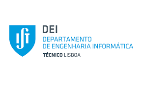
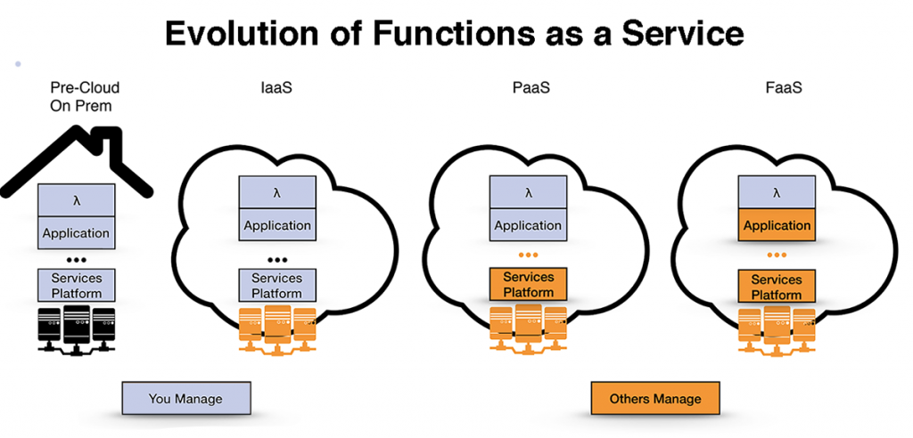

<a href="https://dei.tecnico.ulisboa.pt/"></a>

### [Cloud Computing and Virtualization 2023/2024](https://fenix.tecnico.ulisboa.pt/disciplinas/AVExe23/2023-2024/2-semestre) ([MEIC-A](https://fenix.tecnico.ulisboa.pt/cursos/meic-a)/[MEIC-T](https://fenix.tecnico.ulisboa.pt/meic-t), [METI](https://fenix.tecnico.ulisboa.pt/merc), [MECD](https://fenix.tecnico.ulisboa.pt/cursos/mecd))

&nbsp;
&nbsp;
&nbsp;
&nbsp;

# Lab 4: Introduction to FaaS - Function-as-a-Service
---

Function-as-a-Service is a new cloud programming model where applications are decomposed into small logic units called functions. Developers package applications into functions which are then automatically deployed and managed by the cloud provider. Compared to IaaS, FaaS frees developers from managing and scaling servers. Using FaaS, users only pay for the resouces used to handle request and not for the entire server lifetime.




In today's lab we will look into Amazon Lambda, a FaaS service (also commonly reffered to as a Serverless service). We will be deploying a simple application using the web console, CLI tool, and programatically using Java.


---


## Lab setup

---

1. Clone (`git clone https://git.rnl.tecnico.ulisboa.pt/cnv/cnv24.git`) or pull (`git pull` if you have cloned it before) the repository;
1. Go to the labs-faas directory: `cd cnv24/labs/labs-faas`
2. Build the project using maven: `mvn package`

---


## Part I: Deploying a Lambda fuction using AWS's web console.

---

Using AWS's web console, it is possible to create and test a Lambda function. There are several methods to register a function. In this lab, we will upload a Jar compiled locally.

Follow this step-by-step [guide](https://gitlab.rnl.tecnico.ulisboa.pt/cnv/cnv24/-/blob/master/labs/lab-faas/res/AWS%20Lambda%20-%20Web%20Console.pdf) to register and invoke a new Lambda.

---

## Part II: Deploying a Lambda function using AWS's CLI tool.

---

AWS's CLI also allows you to register and invoke Lambda functions. Assuming the [config.sh](../lab-aws/scripts/config.sh) is already loaded into your environment (just run `source <path>/config.sh), follow the instructions below.

Before creating a function, create a new IAM (Identity and Access Management) role:

```
aws iam create-role \
        --role-name lambda-role \
        --assume-role-policy-document '{"Version": "2012-10-17","Statement": [{ "Effect": "Allow", "Principal": {"Service": "lambda.amazonaws.com"}, "Action": "sts:AssumeRole"}]}'
```

Then, attach a Lambda execution policy to the new-ly created role:

```
aws iam attach-role-policy \
        --role-name lambda-role \
        --policy-arn arn:aws:iam::aws:policy/service-role/AWSLambdaBasicExecutionRole
```

Finally, create the function:

```
aws lambda create-function \
        --function-name eg-lambda \
        --zip-file fileb://../target/lab-faas-1.0-SNAPSHOT-jar-with-dependencies.jar \
        --handler pt.ulisboa.tecnico.cnv.faas.Handler \
        --runtime java11 \
        --timeout 5 \
        --memory-size 256 \
        --role arn:aws:iam::$AWS_ACCOUNT_ID:role/lambda-role
```

After creating the function, you can now invoke it:

```
aws lambda invoke --function-name eg-lambda out --payload '{ "number": "10" }' --log-type Tail --query 'LogResult' --output text |  base64 -d
```

The output is in the `out` file:

`cat out `

If you want to delete the function, role, and policy, run the following commands:

```
aws lambda delete-function --function-name eg-lambda

aws iam detach-role-policy \
        --role-name lambda-role \
        --policy-arn arn:aws:iam::aws:policy/service-role/AWSLambdaBasicExecutionRole

aws iam delete-role --role-name lambda-role
```

---

## Part III: Deploying a Lambda function using AWS's Java SDK.

---

AWS also offers a programmatic inferface to interact with Amazon Lambda. In particular, the Java example below allows you to invoke a function previously registered.

Take a look at the Java source code in [InvokeFactorial.java](src/main/java/pt/ulisboa/tecnico/cnv/faas/InvokeFactorial.java).

To launch the Java class, type the following command:

```
java -cp target/lab-faas-1.0-SNAPSHOT-jar-with-dependencies.jar pt.ulisboa.tecnico.cnv.faas.InvokeFactorial
```

---

## Part IV (recap): Amazon DynamoDB 

---

Amazon DynamoDB is a NoSQL database service that supports key–value and document data structures and is ran by Amazon, as part of the Amazon Web Services portfolio. DynamoDB can be used without any previous setup (i.e., it has no fixed infrastructure managed by the client), and can be used directly through a number of AWS produces such as EC2 and Lambda.

Conside the Java source code example available in [AmazonDynamoDBSample.java](res/AmazonDynamoDBSample.java).

Notes:

- when compiling or invoking a Java application that interacts with AWS, always include the SDK in the classpath (the exact `jar` name and version might change):

    - `javac -cp <path-to-aws-sdk>/lib/aws-java-sdk-1.12.196.jar:<path-to-aws-sdk>/third-party/lib/*:. <Java file>`

    - `java -cp <path-to-aws-sdk>/lib/aws-java-sdk-1.12.196.jar:<path-to-aws-sdk>/third-party/lib/*:. <Main Class>`

- remember to load the [config.sh](../lab-aws/scripts/config.sh) into your environment. This file contains credentials necessary for the SDK to connect to your AWS account:

    - `source config.sh`


---

## Part V (extra): Integrating FaaS in SpecialVFX@Cloud

---

Having seen how to create a FaaS function for a Java application packaged into a Jar, and how to invoke a function from Java code, you are now ready to try launching SpecialVFX@Cloud as a Java function and using your load balancer to invoke it.
