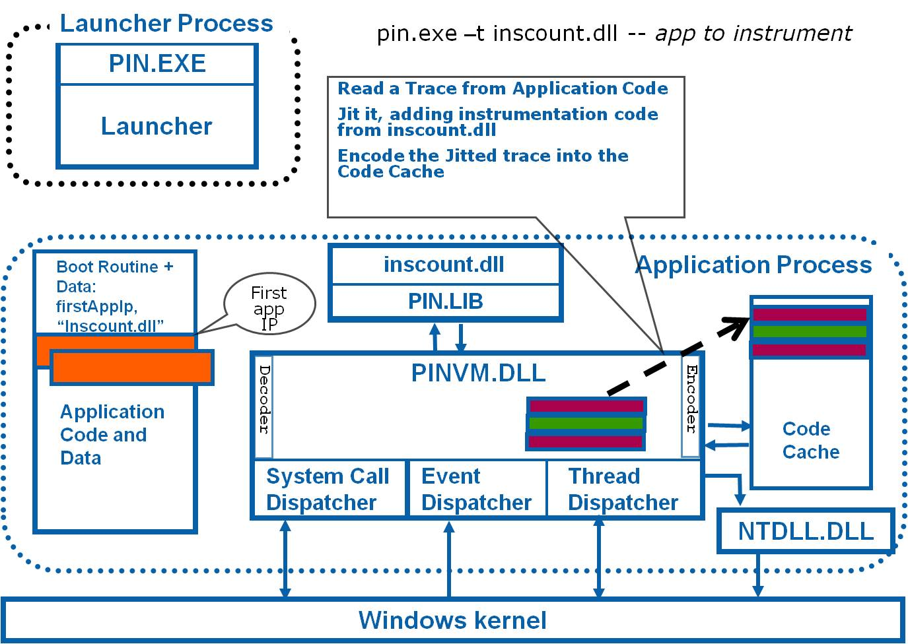

### [Cloud Computing and Virtualization 2023/2024](https://fenix.tecnico.ulisboa.pt/disciplinas/AVExe23/2023-2024/2-semestre) ([MEIC-A](https://fenix.tecnico.ulisboa.pt/cursos/meic-a)/[MEIC-T](https://fenix.tecnico.ulisboa.pt/meic-t), [METI](https://fenix.tecnico.ulisboa.pt/merc), [MECD](https://fenix.tecnico.ulisboa.pt/cursos/mecd))

&nbsp;
&nbsp;
&nbsp;
&nbsp;

# Lab 1: Introduction to Pin - Intel Instrumentation Tool

---

## Overview
[Pin](https://www.intel.com/content/www/us/en/developer/articles/tool/pin-a-dynamic-binary-instrumentation-tool.html?wapkw=pin%20tool) is a tool from Intel for the instrumentation of programs, supporting multiple operating systems (e.g., Windows, Linux, MacOS) on multiple architectures (e.g., IA-32 a.k.a. x86, IA-32 EM64T a.k.a. x86-64, IA-64 a.k.a. Itanium).

Instrumentation is performed directly on binary code, once it is loaded on memory, therefore no access to source code is required. All executed code is generated by Pin by dynamically translating original program code. Original application code is never executed, alternating between Pin code and translated code.

Pin operates by applying a tool on a running application. A tool is a user-developed dynamic library containing functions that perform program instrumentation and analysis.

Instrumentation is performed once by registered callback functions that are invoked as code elements of the application program are translated (e.g., individual instructions, basic clocks, routines, libraries). These callbacks can perform modifications to code elements by inserting/appending additional code (e.g., inject calls to analysis functions).

Analysis is performed every time a piece of instrumented code is executed and analysis functions are invoked. Successive invocations of analysis code allows aggregation of results during program execution.

Pin is invoked with the following syntax:

**`pin [Pin args] [-t [Tool Args]] -- [App args] `**

---

### Support Material and Documentation

- [Pin tutorial presented at CGO 2013](res/cgo2013.pdf);

- [Original Pin tutorial from Intel (2006)](res/pin-tutorial-intel-2006.pdf);

- [Pin Kit (version 3.22, Linux)](https://software.intel.com/sites/landingpage/pintool/downloads/pin-3.22-98547-g7a303a835-gcc-linux.tar.gz);

- [Pin Manual (version 3.22, Linux)](https://software.intel.com/sites/landingpage/pintool/docs/98547/Pin/html/);

- [Pin FAQ](https://www.intel.com/content/www/us/en/developer/articles/troubleshooting/pin-a-binary-instrumentation-tool-faq.html);

- [Pin: Building Customized Program Analysis Tools with Dynamic Instrumentation](https://www.cs.ucr.edu/~heng/teaching/cs260-winter2017/luk05pin.pdf), original PIN paper presented at PLDI'05;

- [Pin recepient of Most Influential PLDI Paper Award in 2015](http://www.sigplan.org/Awards/PLDI/).

---

### Lab Setup (assuming Linux environment)

- The `pin` executable should already be in the command line path. Something like this should already work:

&nbsp;&nbsp;&nbsp;&nbsp;&nbsp;&nbsp; `pin -version`

- To make it easier to compile and modify Pin tools, copy the Pin installation to a temporaty directory:

&nbsp;&nbsp;&nbsp;&nbsp;&nbsp;&nbsp; `cp -r /opt/pin /tmp/cnv-pin`

-  Build the manual Pin tool examples from source code:

&nbsp;&nbsp;&nbsp;&nbsp;&nbsp;&nbsp; `cd /tmp/cnv-pin/source/tools/ManualExamples`

&nbsp;&nbsp;&nbsp;&nbsp;&nbsp;&nbsp; `make`

-  Build the simple Pin tool examples from source code:

&nbsp;&nbsp;&nbsp;&nbsp;&nbsp;&nbsp; `cd /tmp/cnv-pin/source/tools/SimpleExamples`

&nbsp;&nbsp;&nbsp;&nbsp;&nbsp;&nbsp; `make`

---

### Structure of a Pin tool

A Pin file is normally divided in the following sections:

- **Global variables**, used to aggregate results;

- **Command line switches**, i.e., KNOBS: used to pass arguments to pin tools (e.g., KnobOutputFile);

- **Usage Function**, prints tool usage syntax;

- **Analysis routines**, used to update global variables when executed in instrumented code;

- **Instrumentation routines**, used to configure program instrumentation by inserting calls to analysis routines.

When using Pin to instrument an application, the following steps should be followed:

- initialize Pin;

- check Knobs;

- add/install instrumentation routines;

- start the instrumented application.

---

---

## Part I: analyzing existing Pin tools.

For each of the following sections, analyse and test the following pin tools.

- check if there is help regarding pin tool usage. E.g.,

&nbsp;&nbsp;&nbsp;&nbsp;&nbsp;&nbsp; `pin -t <tool path> -help -- ls`

- test the tool with a simple command. E.g.,

&nbsp;&nbsp;&nbsp;&nbsp;&nbsp;&nbsp; `pin -t <tool path> -- ls -la`

- check any result written to a an output file. E.g.,

&nbsp;&nbsp;&nbsp;&nbsp;&nbsp;&nbsp; `less <tool name>.out`

- analyse the tool's source code and identify the main logic components (analysis routines, instrumentation routines, main);

- test the tool with more complex applications/workloads. E.g.,

&nbsp;&nbsp;&nbsp;&nbsp;&nbsp;&nbsp; `pin -t <tool path> -- ls -lR`

&nbsp;&nbsp;&nbsp;&nbsp;&nbsp;&nbsp; `pin -t <tool path> -- vim`

&nbsp;&nbsp;&nbsp;&nbsp;&nbsp;&nbsp; `pin -t <tool path> -- htop`

---

### Analysing Instructions

- **Simple Instruction Count**: checks number of executed instructions of application program;

    - tool path: `/tmp/cnv-pin/source/tools/ManualExamples/obj-intel64/inscount0.so`;

    - source: `/tmp/cnv-pin/source/tools/ManualExamples/inscount0.cpp`;

    - output: `inscount.out`

- **Address Trace of Executed Instructions**: lists addresses of executed instructions of application program;

    - tool path: `/tmp/cnv-pin/source/tools/ManualExamples/obj-intel64/itrace.so`;

    - source: `/tmp/cnv-pin/source/tools/ManualExamples/itrace.cpp`;

    - output: `itrace.out`

- **Address Trace of Referenced Memory Positions**: lists addresses of accessed memory and type of operation (read, write);

    - tool path: `/tmp/cnv-pin/source/tools/ManualExamples/obj-intel64/pinatrace.so`

    - source: `/tmp/cnv-pin/source/tools/ManualExamples/pinatrace.cpp`;

    - output: `pinatrace.out`

- **Analysis of Types of Executed Instructions (extra/optional)**: lists opcodes of executed instructions with number of executions and category summary (look for special instructions such as INT, SYSENTER/SYSCALL, ...);

    - tool path: `/tmp/cnv-pin/source/tools/SimpleExamples/obj-intel64/opcodemix.so`

    - source: `/tmp/cnv-pin/source/tools/SimpleExamples/opcodemix.cpp`;

    - output: `opcodemix.out`

- **Analysis of Register Use**: shows register use statistics;

    - tool path: `/tmp/cnv-pin/source/tools/SimpleExamples/obj-intel64/regmix.so`

    - source: `/tmp/cnv-pin/source/tools/SimpleExamples/regmix.cpp`;

    - output: `regmix.out`

---

### Analysing Routines and Libraries

- **Routine Invocation Call**: counts number of times each routine is invocked and number of instructions in it;

    - tool path: `/tmp/cnv-pin/source/tools/ManualExamples/obj-intel64/proccount.so`;

    - source: `/tmp/cnv-pin/source/tools/ManualExamples/proccount.cpp`

    - output: `proccount.out`

- **Identify Libraries Used by Program**: lists loading and unloading of dynamic libraries invoked by program;

    - tool path: `/tmp/cnv-pin/source/tools/ManualExamples/obj-intel64/imageload.so`;

    - source: `/tmp/cnv-pin/source/tools/ManualExamples/imageload.cpp`

    - output: `imageload.out`

---

---

## Part II: creating new Pin tools.

To create a new Pin tool, you can use the following steps:

- Copy the `/tmp/cnv-pin/source/tools/MyPinTool` directory into a new tool directory. E.g.,

    `cp -r /tmp/cnv-pin/source/tools/MyPinTool /tmp/cnv-pin/source/tools/<new tool name>`

- Check that it builds. E.g.,

    `cd /tmp/cnv-pin/source/tools/<new tool name>`

    `make`

- Modify `MyPinTool` to comply with the goals of your new tool!

---

### Implementing a Basic Block Cache

Design new tool with the functionality of the core component of a Basic Block Code Cache. In particular, count number of executions of basic blocks, and keep information of most recently executed basic blocks (e.g., approximating a round-robbin code cache of N blocks). On each execution, check if there would be a hit (preserving the block by refreshing its last execution), or a miss in the cache (consider a starting capacity of N=128). Finally aggregate results of efficiency with counts, and hits and misses in the basic block cache.

Suggested steps:

- Use `MyPinTool` as a template for this new tool (as illustrated above);

- Create structure `BblLastCall_t` to hold relevant information about each basic block:

    - address (`bbl_addr` of type `ADDRINT`) and

    - iteration of last execution (`last_bbl_call` of type `UINT64`).

- Create a C++ container, such as a map to hold data of all basic blocks (`std::map` for example). Do not forget to  include the map header file `#include <map>` at the top of the file.

- Extend the global variables to hold global statistics about hits and misses in the cache; define the cache size (later repeat tests with smaller and larger values to check different results):

<pre><code>
    UINT64 insCount = 0; // number of dynamically executed instructions
    UINT64 bblCount = 0; // number of dynamically executed basic blocks
    UINT64 threadCount = 0; // total number of threads, including main thread
    UINT64 bbl_hits = 0;
    UINT64 bbl_misses = 0;
    UINT64 bbl_cache_size = 128;
</pre></code>

- In analysis routine `CountBbl`, modify it to receive one additional argument to track basic block address:

    `VOID CountBbl(UINT32 numInstInBbl, ADDRINT BblAddr) {`

- In analysis routine `CountBbL`, access the basic block data, receive an additional argument to track basic block address:

    `BblLastCall_t &bbl = cache[BblAddr];`

- Still in `CountBbL`, check whether basic block address matches the argument passed

    - if no match initialize address and count, and increment one miss found;

    - if there is match, check how long ago the block was executed last, and register miss or hit accordingly, updating counts:

         `if (bbl.last_bbl_call + bbl_cache_size < bblCount) {`

- In function `TRACE`, pass the additional argument to `CountBBl`:

    `BBL_InsertCall(bbl, IPOINT_BEFORE, (AFUNPTR)CountBbl, IARG_UINT32, BBL_NumIns(bbl), IARG_ADDRINT, BBL_Address(bbl), IARG_END);`

- Extend `FINI` routine to output all the new statistics;

- Edit the first `KNOB` in the source code and replace the empty string with the name of the results file;

- Run `make` and address syntax and semantic errors.

---

### Implementing a Register Allocator for Basic Block Translation

Design new tool with the functionality of the core component of Register Allocator for Basic Block Translation. In particular, for each basic block, keep information (counts) of the registers used by the code in that block. This information allows to find out the registers more heavily used in each block, and coud be used to drive register allocation decisions, i.e., which target (i.e., native) register should we map each register used (in the original code) to.

Suggested steps:

- Use `MyPinTool` as a template for this new tool (as illustrated above);

- Replace `MyPinTool.cpp` by `regmix.cpp` (from SimpleExamples), as it will be our basis for this sample tool;

- Extend class `BBLSTATS` to hold additional information regarding basic block addresses and register usage inside the block, following the same approach for the global statistics.

    - Include new proper initialization code in the constructor:

<pre><code>
BBLSTATS(UINT16 * stats, ADDRINT addr) : _stats(stats),_counter(0) ,_bbl_addr(addr) {
    for ( UINT32 i = 0; i < MAX_REG; i++) {
        _localStats.reg_r[i]=0;
        _localStats.reg_w[i]=0;
    }
};
</pre></code>

- Still in `BBLSTATS`, add the new fields to hold relevant information:

    `ADDRINT _bbl_addr;`

    `struct GLOBALSTATS _localStats;`

- Extend function `ComputeGlobalStats` to record and consider register usage count information, specific to each basic block:

    - declare local variable inside block iterator to point to each block local statistics:

    `struct GLOBALSTATS *blockStats = (GLOBALSTATS *)&(*bi)->_localStats;`

    - record register usage within the for iteration aggregating all the statistics for the block:

    `GlobalStats.reg_r[*stats] += (*bi)->_counter;`

    `blockStats->reg_r[*stats] += (*bi)->_counter;`

- For each basic block (outer for iteration) print header information for basic block with its header. Tip: to print addresses use `StringFromAddrint((*bi)->_bbl_addr)`;

- For each basic block (outer for iteration) print all the information regarding register usage in the block that was previously aggregated. Look at the code from `Fini()` where you can find

     `for ( UINT32 i = 0; i < MAX_REG; i++)`

    ... and change it to get info from `_localStats` fields instead of `GlobalStats`.

- Run `make` and address syntax and semantic errors.

---

### Implementing a System-calls Tracker (extra/optional)

Design new tool with the functionality of identifying Basic Blocks that invoke system-calls (core component for identification of blocks where OS emulation is needed). In particular, detect and record information regarding the basic blocks that invoke system-calls. In a process VM, these blocks must be detected beforehand (as seen in lectures), and emulated without allowing the guest code access the host OS directly (that might not even be executing in the machine).

Overall approach:

- Based on the previous two exercises, add information for each block regarding how many times a system call instruction is executed in each basic block;

- To check whether an instruction is a system call invocation, use the following test:

    `if (INS_IsSyscall(ins))`

