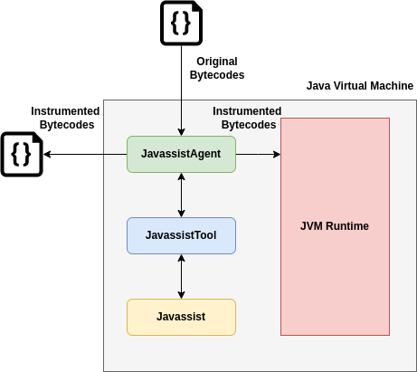
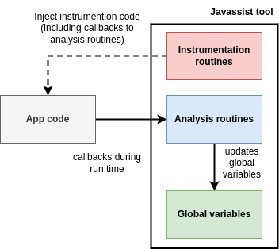

### [Cloud Computing and Virtualization 2023/2024](https://fenix.tecnico.ulisboa.pt/disciplinas/AVExe23/2023-2024/2-semestre) ([MEIC-A](https://fenix.tecnico.ulisboa.pt/cursos/meic-a)/[MEIC-T](https://fenix.tecnico.ulisboa.pt/meic-t), [METI](https://fenix.tecnico.ulisboa.pt/merc), [MECD](https://fenix.tecnico.ulisboa.pt/cursos/mecd))

&nbsp;
&nbsp;
&nbsp;
&nbsp;

# Lab 3: Introduction to Javassist - Java Bytecode Instrumentation Tool

---

## Overview

[Javassist](https://www.javassist.org/) is a very simple tool, fully written in Java (i.e., a collection of Java classes) that allows building customized tools to instrument Java Virtual Machine (JVM) bytecodes while they are being loaded into the VM. Javassist is a widely used tool in both industry and academia, and exposes a simple but powerful API. Other similar tools include JOIE (Java Object Instrumentation Environment) and BCEL (Bytecode Engineering Library), Soot, and BIT (Bytecode Instrumenting Tool).

Javassist is designed to perform analysis and instrumentation of Java applications without need to resort to source code. It is able to parse class files, and extract the various components of a class file (e.g., constant pool, type definitions, method definitions, individual bytecode instructions) into Java objects that can be queried and modified, and later re-synched to disk.

Moreover, Javassist is also able to instrument classes, i.e., inject automatically generated bytecodes that perform method calls to your Java code. Code can be instrumented with different granularities (e.g., on every instruction, basic block, method, class). Through invocation of instrumented code, Javassist is able to collect data for dynamic analysis. Thus, it allows the user to observe the dynamic behavior of applications by inserting calls to user analysis methods at any point in the bytecode execution.

You will use Javassist to gather static information about some example programs (namely from Java basic blocks), instrument them in order to profile their dynamic behavior. Javassist is a offered as a library which allows applications to take advantage of it in different ways. For the purpose of this course, we created a simple Java agent which will be used to intercept class loading and instrument classes before these are loaded into the JVM:

To invoke the JavassistAgent, use the following syntax:

**`java -cp <app classpath> -javaagent:</path/to/JavassistAgent.jar>=<tool name>:<package to instrument>:<path to write instrumented bytecodes> <main app class>`**

---

### Support Material and Documentation

- [Javassist web page](https://www.javassist.org/);

- [Load-time Structural Reflection in Java](https://citeseerx.ist.psu.edu/document?repid=rep1&type=pdf&doi=d81c33f3c7172a538bd81047ce51a4f70f4a16e9), original Javassist paper presented at ECOOP'00;

- [An Easy-to-Use Toolkit for Efficient Java Bytecode Translators](https://static.csg.ci.i.u-tokyo.ac.jp/papers/03/chiba-gpce03.pdf), subsequent Javassist paper presented at GPCE '03;

- [Javassist API](https://www.javassist.org/html/index.html);

- [Javassist Tutorial](https://www.javassist.org/tutorial/tutorial.html);

- [Class file format](https://docs.oracle.com/javase/specs/jvms/se7/html/jvms-4.html);

- [Java Bytecode instructions](http://docs.oracle.com/javase/specs/jvms/se11/html/jvms-6.html)

---

### Lab Setup (assuming Linux environment)

- Get JavassistAgent by either downloading or cloning the repository: 

&nbsp;&nbsp;&nbsp;&nbsp;&nbsp;&nbsp; `git clone https://gitlab.rnl.tecnico.ulisboa.pt/cnv/cnv24/`

- Change directory into `lab-javassist`:

&nbsp;&nbsp;&nbsp;&nbsp;&nbsp;&nbsp; `cd cnv24/labs/lab-javassist`

- Build application examples:

&nbsp;&nbsp;&nbsp;&nbsp;&nbsp;&nbsp; `javac apps/pt/ulisboa/tecnico/cnv/javassist/apps/*.java`

- Build JavassistAgent:

&nbsp;&nbsp;&nbsp;&nbsp;&nbsp;&nbsp; `mvn clean package`

---

### Structure of a Javassist tool

A Javassist tool is normally divided into the following sections:

- **Global static variables**, used to aggregate analysis results;

- **Analysis routines**, called by the instrumented code, typically update global static variables;

- **Instrumentation routines**, code executed during the instrumentation phase to instrument the code, installs calls to analysis routines.

---

---

## Part I: analyzing existing Javassist tools.

For each of the sample instrumention tools and Java application examples, in the text section,

- run the original application. E.g.,

&nbsp;&nbsp;&nbsp;&nbsp;&nbsp;&nbsp; `java -cp apps pt.ulisboa.tecnico.cnv.javassist.apps.Fibonacci`

- analyze the original application bytecode. E.g.,

&nbsp;&nbsp;&nbsp;&nbsp;&nbsp;&nbsp; `javap -c apps/pt/ulisboa/tecnico/cnv/javassist/apps/Fibonacci.class`

- run the JavassistAgent with one of the tools (recap the syntax described above). E.g.,

&nbsp;&nbsp;&nbsp;&nbsp;&nbsp;&nbsp; `java -cp apps -javaagent:target/JavassistWrapper-1.0-jar-with-dependencies.jar=ICount:pt.ulisboa.tecnico.cnv.javassist.apps:output pt.ulisboa.tecnico.cnv.javassist.apps.Fibonacci`

- analyze the instrumented application bytecode. E.g.,

&nbsp;&nbsp;&nbsp;&nbsp;&nbsp;&nbsp; `javap -c output/pt/ulisboa/tecnico/cnv/javassist/apps/Fibonacci.class`

---

### Javassist Tools

- **CodeDumper**: prints out the name of classes, methods, and the discovered basic blocks;

- **MethodAnalyser**: prints out the name of all of the methods in each class and the access\_flags of the method;

- **ClassAnalyser**: prints out the name of all of the classes along with the declared supertypes and interfaces;

- **MethodExecutionTimer**: prints out the time spent execution a method;

- **ICount**: prints out the count of total instruction executions, basic block, and method inovations;

- **BranchStatistics**: prints out the number of times each basic block was executed.

---

### Java Applications

- **Hello**: simple hello world;

- **Fibonacci**: prints out the first 20 numbers if the Fibonacci sequence;

- **Factorial4**: prints the factorial up to 50;

- **TestOpsVarsFields**: simple example class that exercises parameter passing, field and variable accesses to examine resulting bytecodes;

- **FileCopy**: standalone and utility class to copy files;

- **Compress$Test**: gzip-compresses a file to a specified target;

- **ThreadLister**: list threads currently in execution.

---

---

### Part II: creating new Javassist tools.

Creating a new Javassist tool is as simple as creating a new subclass of `AbstractJavassistTool`. In the new tool, you can then override `transform` methods to decide how to instrument methods, constructors, and basic blocks. To instrument code, reffer to the already provided example tools, and to Javassist [API documentation](https://www.javassist.org/html/index.html) and [tutorial](https://www.javassist.org/tutorial/tutorial.html).

Create a tool similarl to the Basic Block Cache build with Pin but this time with Javassist. It will be able to simulate the effect of a basic block cache for your Java applications.
